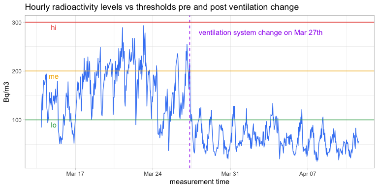
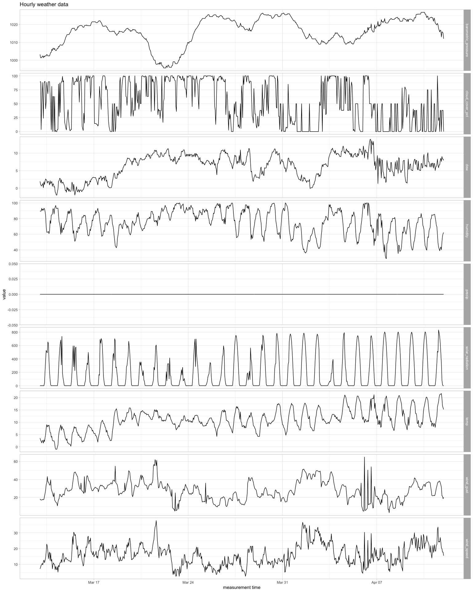
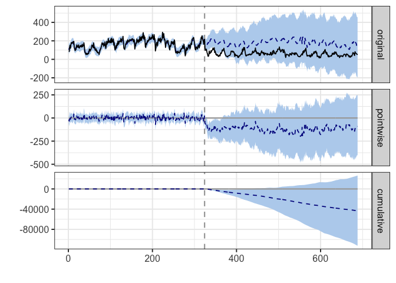

Impact of change in ventilation system on radon levels
================
arnaud
2025-04-12

### 1. Import libraries

``` r
library(tidyr)
library(dplyr)
library(lubridate)
library(ggplot2)
library(glue)
library(corrr)
library(ggcorrplot)
library(CausalImpact)
```

### 2. Load and clean up data

I am measuring hourly radioactivity levels with an Ecosense EcoQube and
I can export them as a .txt file. The ventilation change occurred on Mar
27th. We only need hour precision so removing minutes from the
timestamps.

``` r
# load, create hourly timestamp and check data types
df_rad <- read.csv('measurements.txt')
df_rad$Approx.Time <- as.POSIXct(trunc(dmy_hm(df_rad$Measurement.Time), units = 'hours'))
sapply(df_rad, class)
```

    ## $Measurement.Time
    ## [1] "character"
    ## 
    ## $Radon.Hourly.Reading
    ## [1] "integer"
    ## 
    ## $Approx.Time
    ## [1] "POSIXct" "POSIXt"

``` r
# cut-off point
ventilation_change_time <- as.POSIXct('2025-03-27 09:00:00') 
df_rad <- df_rad %>% mutate(
  period = case_when(
    Approx.Time <= ventilation_change_time ~ 'pre', .default = 'post'
    )
  )
```

I was also able to find hourly weather data for the town the house is in
on a website called
<a href="https://www.visualcrossing.com/weather-data/"
class="uri">Visual Crossing</a>.

``` r
df_wea <- read.csv('weather.csv') %>% select(c(
  datetime
  , temp
  , dew
  , humidity
  , precip
  , wind_gust = windgust
  , wind_speed = windspeed
  , barometric_pressure = sealevelpressure
  , cloud_cover_pct = cloudcover
  , solar_radiation = solarradiation
  )
  ) %>%
  # create new timestamp that matches the radioactivity data
  mutate(raw_yyyy_mm_dd = substr(datetime, 1, 10)
         , raw_hh = substr(datetime, 12, 13)
         , space = rep(' ')
         , padding = rep(':00')
  )  %>%
  unite(Approx.Time, c(raw_yyyy_mm_dd, space, raw_hh, padding), sep = '')
df_wea$Approx.Time <- ymd_hm(df_wea$Approx.Time)
sapply(df_wea, class)
```

    ## $datetime
    ## [1] "character"
    ## 
    ## $temp
    ## [1] "numeric"
    ## 
    ## $dew
    ## [1] "numeric"
    ## 
    ## $humidity
    ## [1] "numeric"
    ## 
    ## $precip
    ## [1] "integer"
    ## 
    ## $wind_gust
    ## [1] "numeric"
    ## 
    ## $wind_speed
    ## [1] "numeric"
    ## 
    ## $barometric_pressure
    ## [1] "numeric"
    ## 
    ## $cloud_cover_pct
    ## [1] "numeric"
    ## 
    ## $solar_radiation
    ## [1] "integer"
    ## 
    ## $Approx.Time
    ## [1] "POSIXct" "POSIXt"

Check if there are no duplicate timestamps.

``` r
df_rad %>% filter(duplicated(Approx.Time))
```

    ## [1] Measurement.Time     Radon.Hourly.Reading Approx.Time         
    ## [4] period              
    ## <0 rows> (or 0-length row.names)

``` r
df_wea %>% filter(duplicated(Approx.Time))
```

    ##  [1] datetime            temp                dew                
    ##  [4] humidity            precip              wind_gust          
    ##  [7] wind_speed          barometric_pressure cloud_cover_pct    
    ## [10] solar_radiation     Approx.Time        
    ## <0 rows> (or 0-length row.names)

### 3. EDA

Let’s eyeball the radiation levels data.

``` r
head(df_rad, 5)
```

    ##   Measurement.Time Radon.Hourly.Reading         Approx.Time period
    ## 1 13/03/2025 21:09                   85 2025-03-13 21:00:00    pre
    ## 2 13/03/2025 22:09                   85 2025-03-13 22:00:00    pre
    ## 3 13/03/2025 23:09                  132 2025-03-13 23:00:00    pre
    ## 4 14/03/2025 00:09                  153 2025-03-14 00:00:00    pre
    ## 5 14/03/2025 01:09                  120 2025-03-14 01:00:00    pre

``` r
tail(df_rad, 5)
```

    ##     Measurement.Time Radon.Hourly.Reading         Approx.Time period
    ## 684 11/04/2025 10:46                   66 2025-04-11 10:00:00   post
    ## 685 11/04/2025 11:46                   63 2025-04-11 11:00:00   post
    ## 686 11/04/2025 12:46                   58 2025-04-11 12:00:00   post
    ## 687 11/04/2025 13:46                   52 2025-04-11 13:00:00   post
    ## 688 11/04/2025 14:46                   56 2025-04-11 14:00:00   post

``` r
p <- ggplot(df_rad, aes(x = Approx.Time, y = Radon.Hourly.Reading)) +
  geom_line(color = '#4285F4') + 
  geom_vline(xintercept = ventilation_change_time, linetype = 'dashed', color = '#a020f0') +
  geom_hline(yintercept = 100, color = '#34a853') +
  geom_hline(yintercept = 200, color = '#f4b400') +
  geom_hline(yintercept = 300, color = '#ea4335') +
  annotate(geom = 'text'
           , x = ventilation_change_time + lubridate::hours(155) 
           , y = 280
           , label = 'ventilation system change on Mar 27th'
           , color = '#a020f0') +
  annotate(geom = 'text'
           , x = ventilation_change_time - lubridate::hours(295) 
           , y = 90
           , label = 'lo'
           , color = '#34a853') +
  annotate(geom = 'text'
           , x = ventilation_change_time - lubridate::hours(295) 
           , y = 190
           , label = 'me'
           , color = '#f4b400') +
  annotate(geom = 'text'
           , x = ventilation_change_time - lubridate::hours(295) 
           , y = 290
           , label = 'hi'
           , color = '#ea4335') +
  ggtitle('Hourly radioactivity levels vs thresholds pre and post ventilation change') +
  xlab('measurement time') +
  ylab('Bq/m3') +
  theme_light()
p
```

<!-- -->

What were the mean radioactivity levels pre vs post intervention?

``` r
df_grp <- df_rad %>%
  group_by(period) %>%
  summarise(mean_bq_per_m3 = mean(Radon.Hourly.Reading))

pre.mean = filter(df_grp, period == 'pre')$mean_bq_per_m3
post.mean = filter(df_grp, period == 'post')$mean_bq_per_m3
rel_diff.mean = (post.mean - pre.mean) / pre.mean

glue('We went from {round(pre.mean, 1)} Bq/m3 in the pre period to {round(post.mean, 1)} Bq/m3, that is a {round(100 * rel_diff.mean, 1)}% change.')
```

    ## We went from 161.9 Bq/m3 in the pre period to 60.9 Bq/m3, that is a -62.4% change.

Now let’s take a look at our weather data.

``` r
head(df_wea, 5)
```

    ##              datetime temp dew humidity precip wind_gust wind_speed
    ## 1 2025-03-13T00:00:00  3.5 1.9    89.31      0      18.4        7.2
    ## 2 2025-03-13T01:00:00  2.7 1.1    89.52      0      17.6        8.1
    ## 3 2025-03-13T02:00:00  2.2 0.7    89.55      0      17.3        9.5
    ## 4 2025-03-13T03:00:00  1.6 0.6    93.06      0      17.3        9.9
    ## 5 2025-03-13T04:00:00  2.5 1.0    90.36      0      17.6       10.6
    ##   barometric_pressure cloud_cover_pct solar_radiation         Approx.Time
    ## 1              1003.2            88.8               0 2025-03-13 00:00:00
    ## 2              1001.4            89.9               0 2025-03-13 01:00:00
    ## 3              1001.4             3.5               0 2025-03-13 02:00:00
    ## 4              1001.4            50.0               0 2025-03-13 03:00:00
    ## 5              1002.3            88.2               0 2025-03-13 04:00:00

``` r
tail(df_wea, 5)
```

    ##                datetime temp dew humidity precip wind_gust wind_speed
    ## 715 2025-04-11T19:00:00 21.7 7.6    40.06      0      31.3       20.5
    ## 716 2025-04-11T20:00:00 19.7 9.0    50.13      0      22.0       19.9
    ## 717 2025-04-11T21:00:00 16.7 8.3    57.48      0      21.6       17.8
    ## 718 2025-04-11T22:00:00 15.9 8.3    60.68      0      18.7       17.8
    ## 719 2025-04-11T23:00:00 15.2 7.9    62.10      0      20.2       15.5
    ##     barometric_pressure cloud_cover_pct solar_radiation         Approx.Time
    ## 715              1013.0             0.1             329 2025-04-11 19:00:00
    ## 716              1015.8            38.0              83 2025-04-11 20:00:00
    ## 717              1015.8            38.0              14 2025-04-11 21:00:00
    ## 718              1015.1            38.0               0 2025-04-11 22:00:00
    ## 719              1012.0             0.0               0 2025-04-11 23:00:00

Looks like we had no precipitations over the date range considered, or
the data is missing. We can drop the column. The other variables look
usable.

``` r
df_mlt <- df_wea %>%
  select(-c(datetime)) %>%
  pivot_longer(-c(Approx.Time), names_to = 'metric', values_to = 'value') 

p <- ggplot(df_mlt, aes(x = Approx.Time, y = value)) +
  geom_line() + 
  facet_grid(metric ~ ., , scales = 'free') +
  ggtitle(glue('Hourly weather data')) +
  xlab('measurement time') +
  theme_light()
print(p)
```

<!-- -->

``` r
df_wea <- df_wea %>%
  select(-precip)
```

Time to merge our radiation and weather data. How are the variables
correlated? Some association between radon and humlidity (positive),
temperature (negative) and solar radiation (negative). Not surprising
high positive correlation between wind speed and wind gust.

``` r
df_mrg <- df_rad %>%
  inner_join(df_wea, by= 'Approx.Time')

corrr::correlate(df_mrg, method = 'spearman')
```

    ## Non-numeric variables removed from input: `Measurement.Time`, `Approx.Time`, `period`, and `datetime`
    ## Correlation computed with
    ## • Method: 'spearman'
    ## • Missing treated using: 'pairwise.complete.obs'

    ## # A tibble: 9 × 10
    ##   term       Radon.Hourly.Reading    temp      dew humidity wind_gust wind_speed
    ##   <chr>                     <dbl>   <dbl>    <dbl>    <dbl>     <dbl>      <dbl>
    ## 1 Radon.Hou…             NA       -0.390   0.00778   0.478    -0.0145     -0.182
    ## 2 temp                   -0.390   NA       0.560    -0.528     0.158       0.284
    ## 3 dew                     0.00778  0.560  NA         0.330    -0.167      -0.132
    ## 4 humidity                0.478   -0.528   0.330    NA        -0.402      -0.516
    ## 5 wind_gust              -0.0145   0.158  -0.167    -0.402    NA           0.832
    ## 6 wind_speed             -0.182    0.284  -0.132    -0.516     0.832      NA    
    ## 7 barometri…             -0.393   -0.0339 -0.148    -0.0996   -0.281      -0.140
    ## 8 cloud_cov…              0.363   -0.0297  0.383     0.331    -0.0230     -0.130
    ## 9 solar_rad…             -0.243    0.564   0.124    -0.520     0.291       0.367
    ## # ℹ 3 more variables: barometric_pressure <dbl>, cloud_cover_pct <dbl>,
    ## #   solar_radiation <dbl>

### 4. Build counterfactual to assess effect

More info info about Google’s Causal Impact package is available
<a href="https://google.github.io/CausalImpact/CausalImpact.html"
class="uri">here</a>.

``` r
# store indices of beginning and end of pre and post periods in vectors
pre.period <- c(min(which(df_mrg$period == 'pre')), max(which(df_mrg$period == 'pre')))
post.period <- c(min(which(df_mrg$period == 'post')), max(which(df_mrg$period == 'post')))

# prepare dataframe for inference: radon is response variable, rest is covariates
df_ci <- df_mrg %>% select(y = Radon.Hourly.Reading
                       , x1 = temp
                       , x2 = dew 
                       , x3 = humidity 
                       , x4 = wind_gust 
                       , x5 = wind_speed 
                       , x6 = barometric_pressure 
                       , x7 = cloud_cover_pct 
                       , x8 = solar_radiation
)
                    
# run the analysis
impact <- CausalImpact(df_ci, pre.period, post.period)

# display results
plot(impact)
```

<!-- --> The
confidence intervals are super wide but it still illustrates how Causal
Impact works.

``` r
summary(impact)
```

    ## Posterior inference {CausalImpact}
    ## 
    ##                          Average         Cumulative      
    ## Actual                   61              22185           
    ## Prediction (s.d.)        180 (100)       65422 (36325)   
    ## 95% CI                   [-12, 370]      [-4317, 134643] 
    ##                                                          
    ## Absolute effect (s.d.)   -119 (100)      -43237 (36325)  
    ## 95% CI                   [-309, 73]      [-112458, 26502]
    ##                                                          
    ## Relative effect (s.d.)   -23% (408%)     -23% (408%)     
    ## 95% CI                   [-132%, 223%]   [-132%, 223%]   
    ## 
    ## Posterior tail-area probability p:   0.12064
    ## Posterior prob. of a causal effect:  88%
    ## 
    ## For more details, type: summary(impact, "report")
